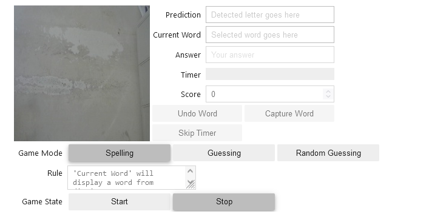
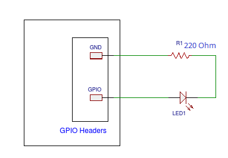
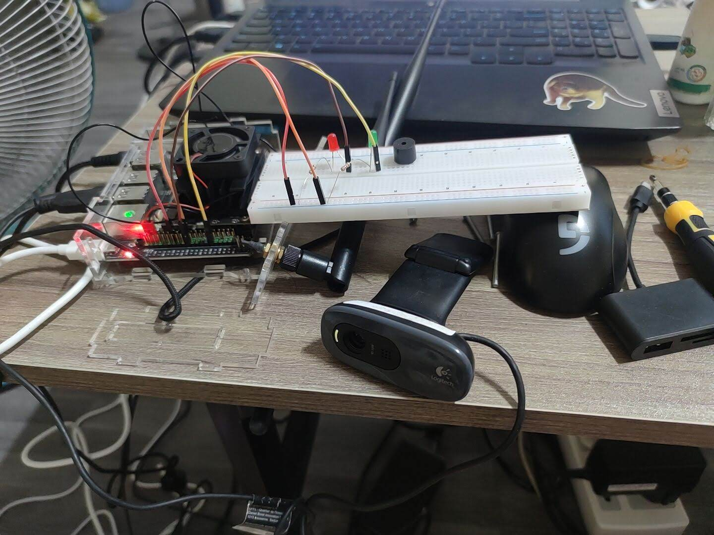

# Word Games using ASL Letter on Jetson Nano

Project based on image classification

## Device

[JETSON-IO-BASE-A - Custom model from Waveshare](https://www.waveshare.com/jetson-nano-dev-kit-a.htm)

OS Ubuntu 18.04.6

Jetpack 4.6.1 (L4T R32.6.1)

[Flashed following this wiki page](https://www.waveshare.com/wiki/JETSON-NANO-DEV-KIT)

## Dependencies

- [Pytorch 1.10 - torchvision 0.11.1](https://forums.developer.nvidia.com/t/pytorch-for-jetson/72048)
- [jetcam](https://github.com/NVIDIA-AI-IOT/jetcam)
- [Jetson.GPIO - Linux for Tegra](https://github.com/NVIDIA/jetson-gpio)
- [opencv](https://github.com/opencv/opencv)
- [Jupyter Lab](https://jupyter.org/)

## Start Project

To start the project, open the folder in Jupyter Lab using command
```
jupyter lab --no-browser
```

In case you want to remote to jupyter lab, use this command instead
```
jupyter lab --ip xx.xx.xx.xx --port 8888 --no-browser
```
Where xx.xx.xx.xx is your current ip in ifconfig, after this, other PCs in the same network can use xx.xx.xx.xx:8888 to access it, there should be token showed in the console where you run the command, use it for authentication

File collection.ipynb
- Use to capture pictures for dataset

File training.ipynb
- Use to train the model

File live-detection.ipynb
- Live detection and game logic

File words.json
- List of words use for the game

## Pre-trained model
[sll-less.pth]() - Model trained on around 30 pictures for each letter and empty background, this model only works for left hand and it work best on a white background, this was used to test the game because it work well for my background - Train time: 10 minutes

[sll-more.pth]() - Model trained on the dataset from repo [Recognizing Sign Language with Jetson Nano](https://developer.nvidia.com/embedded/community/jetson-projects/sign_language_recognition) - Train time: 12 hours

To use these models, download them and put them in the project folder, change the Path variables in the live-detection if needed

## Game rules

The game came with 3 mode: "Spelling","Guessing" and "Random Guessing"

### Spelling
The game chooses a random word from the list, present it to the player, then a timer will start, player will have a set amount of time to spell the word, the word start at the length of 3 and can go up to 10, the letter should be auto-filled in if the player show the camera the correct letter
### Guessing
The game chooses a random word from the list, present it to the player, then a timer will start, player will have to memorize the word, after that, another timer will start, and the player will have to guess the letter at position ntn chosen by the game using the "Capture" button, or "Undo" button if they capture the wrong letter, player can also use "Skip Timer" if they think they got it, the word start at the length of 5 and can go up to 10
### Random Guessing
Same rule as Guessing but instead of words in vocabulary, it's randomly generated string with length that can go up to 25



## GPIO Implementation

 

## Future Improvement

- Change model to test performance, accuracy (currently using Alexnet)
- Find way to improve accuracy, even with the SLR Alphabet Recognizer dataset, including 3000 pictures for each letter plus multiple backgrounds, the prediction is not really that accurate
- Expand to include numbers
- Including buzzer to the GPIO setup to play sound when winning/losing
- Check if classification is possible on vocabulary instead of just letters

## Inspirations

[Nvidia DLI: Getting Started With AI on Jetson Nano](https://github.com/AJV009/Nvidia_DLI_Getting_Started_with_AI_on_Jetson_Nano)

[Rock-Paper-Scissors with Jetson Nano](https://github.com/mokpi/Rock-Paper-Scissors-with-Jetson-Nano)

[Recognizing Sign Language with Jetson Nano](https://developer.nvidia.com/embedded/community/jetson-projects/sign_language_recognition)

[SLR Alphabet Recognizer](https://github.com/loicmarie/sign-language-alphabet-recognizer) for dataset